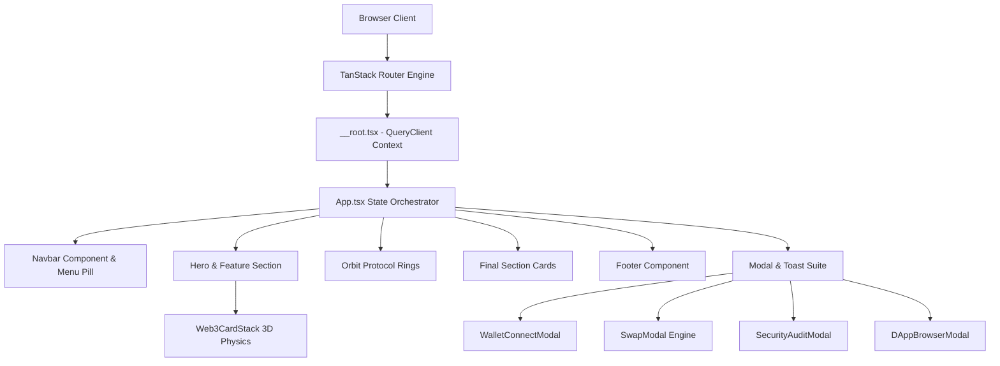
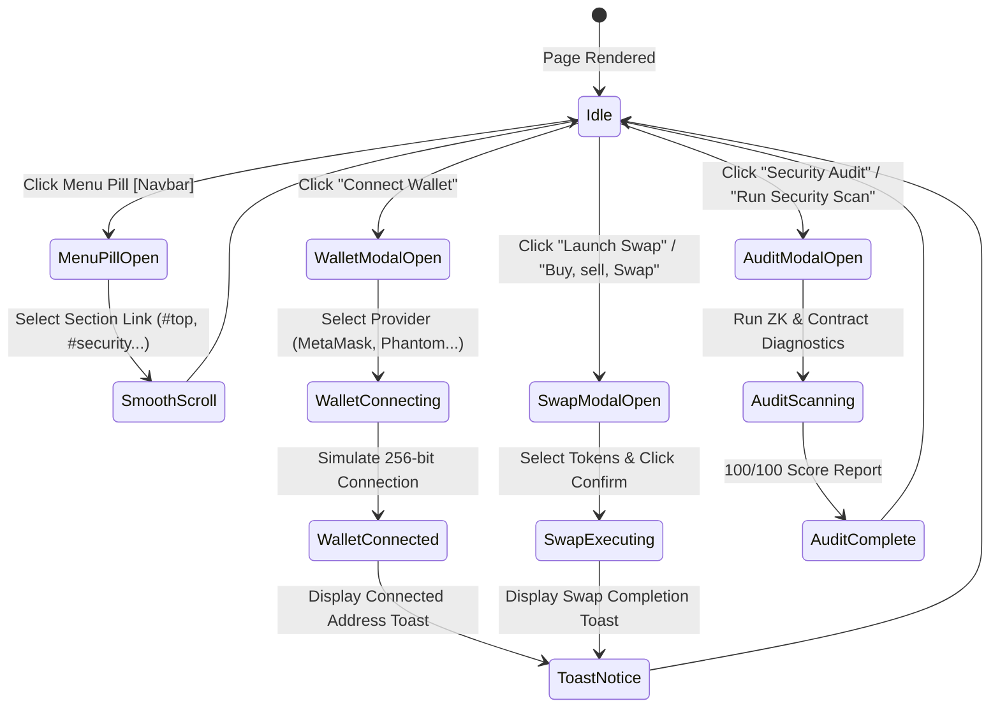

# 🌊 CryptoWave — Decentralized Multi-Chain Asset Platform


> **CryptoWave** is an ultra-premium, modern Web3 landing platform and self-custody application. Built with **React 19**, **TanStack Start**, **TanStack Router**, and **Framer Motion**, it delivers type-safe SSR, a bespoke dark glassmorphic design system, interactive 3D card stacks, cross-chain swap simulations, contract security audits, and a unified Web3 modal suite.

---

## 🎨 Visual Preview & Design System Highlights

> [!TIP]
> **Design Philosophy**: Built around curated HSL color tokens, dark glassmorphism (`backdrop-filter: blur(27px)`), fluid viewport clamp scaling, custom SVG icons, and spring-physics animations. No generic framework defaults or plain colors—every surface is governed by `tokens.css`.

- **🌟 3D Web3 Card Stack**: Layered interactive card deck with spring physics (`stiffness: 300, damping: 26`) previewing Cross-Chain Swaps, Multi-Sig Cloud Vaults, and Integrated dApps.
- **⚡ Navigation Menu Pill**: Compact top-nav Menu Pill dropdown positioned next to the logo, routing seamlessly to every section (`#top`, `#digital-assets`, `#create-wallet`, `#fiat-exchange`, `#security`).
- **🔐 On-Chain Security Scanner**: Real-time smart contract audit progress scanner with ZK-proof checks.
- **🔄 Cross-Chain Swap Engine**: Real-time multi-token rate calculator (BTC, ETH, SOL, USDT) with slippage tolerances.
- **🌐 Web3 dApp Directory**: Category-filtered directory (DeFi, NFTs, Staking) with sandbox launch feedback.
- **🌊 Dark Glassmorphic Footer**: Comprehensive footer with quick directories, newsletter subscription, and scroll-to-top actions.

---

## 🛠️ Technology Stack

| Layer | Technology | Description |
| :--- | :--- | :--- |
| **Core Framework** | `React 19` + `TypeScript 6` | Latest React concurrent features & type safety |
| **Meta-Framework** | `TanStack Start` | Full-stack SSR framework with Nitro server engine |
| **Routing** | `TanStack Router` | Type-safe file-based client & server routing |
| **Data Fetching** | `TanStack Query v5` | Server state management and query client context |
| **Animation Engine** | `Framer Motion 12` | Spring physics, layout animations, 3D card tilts |
| **Styling System** | `CSS Modules` + `tokens.css` | Isolated scoped CSS variables & fluid clamp sizing |
| **Build & Tooling** | `Vite 8` + `Nitro Server` | Instant HMR and self-contained production bundle |

---

## 🏗️ Architecture & Component Flow Diagrams

### 1. System Architecture Flow


### 2. Interactive Modal & Navigation State Flow


---

## 📁 Codebase Directory Structure

```
CryptoWave/
├── package.json                   # Dependencies and scripts (React 19, TanStack Start/Router/Query)
├── tsconfig.json                  # TypeScript compiler configuration
├── vite.config.ts                 # Vite bundler config with TanStack & Tailwind plugins
├── tsr.config.json                # TanStack Router CLI generator configuration
├── src/
│   ├── App.tsx                    # Main app state orchestrator (Modals, Toasts, Sections)
│   ├── router.tsx                 # TanStack Router setup & QueryClient context provider
│   ├── routeTree.gen.ts           # Automatically generated type-safe route tree
│   ├── routes/
│   │   ├── __root.tsx             # Root layout, error boundary, & QueryClientProvider fallback
│   │   ├── index.tsx              # Home landing route definition
│   │   └── about.tsx              # About page route definition
│   ├── styles/
│   │   ├── tokens.css             # Single source of truth design tokens (Colors, Fonts, Clamp radii)
│   │   ├── global.css             # Global base reset and typography rules
│   │   └── reset.css              # Modern CSS reset stylesheet
│   ├── lib/
│   │   ├── error-capture.ts       # SSR error capture handler
│   │   └── lovable-error-reporting.ts # Error telemetry reporter
│   ├── components/
│   │   ├── Navbar/
│   │   │   ├── Navbar.tsx         # Top nav with Logo & interactive Menu Pill dropdown
│   │   │   └── Navbar.module.css  # CSS Module styles for Navbar & Menu Pill
│   │   ├── HeroFeatureSection/
│   │   │   ├── HeroFeatureSection.tsx # Hero section container
│   │   │   └── HeroFeatureSection.module.css
│   │   ├── HeroSection/
│   │   │   ├── HeroCopy.tsx       # Scrambled headline, lede, & action buttons
│   │   │   └── HeroCopy.module.css
│   │   ├── FeatureSection/
│   │   │   ├── PromoCard.tsx      # Powerful Web3 Experiences card container
│   │   │   ├── PromoCard.module.css
│   │   │   ├── Web3CardStack.tsx  # 3D interactive stacked cards deck component
│   │   │   └── Web3CardStack.module.css
│   │   ├── WalletCard/
│   │   │   ├── WalletCard.tsx     # Stage panel & card reveal timing hooks
│   │   │   ├── BalanceCard.tsx    # Interactive balance counter & transaction feed
│   │   │   ├── CardStarField.tsx  # Dynamic star field backdrop
│   │   │   └── ...
│   │   ├── OrbitSection/
│   │   │   ├── OrbitSection.tsx   # Concentric protocol orbit rings section
│   │   │   ├── IconRow.tsx        # Floating crypto protocol badges
│   │   │   └── protocolIcons.ts   # Asset icon dataset definitions
│   │   ├── FinalSection/
│   │   │   ├── FinalSection.tsx   # Bottom feature section container
│   │   │   ├── SecurityCard.tsx   # Security card with interactive audit trigger
│   │   │   ├── SwapCard.tsx       # Crypto exchange card with interactive modal trigger
│   │   │   └── DAppsCard.tsx      # Web3 dApp ecosystem card with category launcher
│   │   ├── Footer.tsx             # Dark glassmorphic footer with directory & newsletter
│   │   ├── Footer.module.css      # Design token CSS rules for Footer
│   │   ├── common/
│   │   │   ├── Modals/
│   │   │   │   ├── WalletConnectModal.tsx # Web3 wallet connection dialog
│   │   │   │   ├── SwapModal.tsx          # Multi-chain token swap simulator
│   │   │   │   ├── SecurityAuditModal.tsx # Smart contract audit scanner
│   │   │   │   └── DAppBrowserModal.tsx  # Verified dApp directory launcher
│   │   │   ├── ToastNotification.tsx      # Reactive toast notification component
│   │   │   ├── motion.tsx                 # WordReveal, Reveal, & motion wrappers
│   │   │   └── TextScramble.tsx           # Matrix text scramble effect hook
│   │   └── icons/
│   │       ├── LogoMark.tsx       # SVG vector logo mark badge
│   │       ├── BitcoinIcon.tsx    # Vector Bitcoin asset icon
│   │       └── index.ts           # Centralized icon exports
```

---

## ⚡ Detailed Code & Feature Explanation

### 1. `src/router.tsx` & `src/routes/__root.tsx` — Context Injection
In TanStack Router, route context allows passing dependency instances (like `QueryClient`) down to every route safely:
```tsx
// src/router.tsx
export function getRouter() {
  const queryClient = new QueryClient()
  return createTanStackRouter({
    routeTree,
    context: { queryClient },
    scrollRestoration: true,
  })
}
```
In `__root.tsx`, the `RootComponent` accesses `queryClient` from the context or initializes a fallback state to prevent unmounted provider errors:
```tsx
function RootComponent() {
  const context = Route.useRouteContext();
  const [fallbackQueryClient] = useState(() => new QueryClient());
  const queryClient = context?.queryClient ?? fallbackQueryClient;

  return (
    <QueryClientProvider client={queryClient}>
      <Outlet />
    </QueryClientProvider>
  );
}
```

---

### 2. `Web3CardStack.tsx` — 3D Perspective Card Stack
The 3D card stack uses spring physics and transform offsets calculated dynamically based on stack depth:
```tsx
// Compute 3D transformation properties based on stack depth
const offset = (index - activeIndex + STACK_CARDS.length) % STACK_CARDS.length;
const translateY = offset * 14;
const scale = 1 - offset * 0.05;
const zIndex = STACK_CARDS.length - offset;
const opacity = offset === 0 ? 1 : offset === 1 ? 0.75 : 0.45;

<motion.div
  animate={{ y: translateY, scale, opacity }}
  transition={{ type: "spring", stiffness: 300, damping: 26 }}
>
  ...
</motion.div>
```

---

### 3. Top Navigation Menu Pill (`Navbar.tsx`)
The top navbar features a clean logo and an interactive `Menu` pill positioned directly next to the logo. Clicking the pill opens a glassmorphic dropdown with smooth internal anchor links (`#top`, `#digital-assets`, `#create-wallet`, `#fiat-exchange`, `#security`) and a "Connect Wallet" trigger button.

---

### 4. `tokens.css` — Visual Design Tokens
All components consume standardized variables defined in `src/styles/tokens.css`:
```css
:root {
  --color-bg: #060606;
  --color-bg-elevated: #0d0d0f;
  --color-panel: #0c0c0e;

  --color-gold: #f6b03c;
  --color-indigo: #6562ea;
  --gradient-accent-diagonal: linear-gradient(135deg, var(--color-gold) 0%, var(--color-indigo) 100%);

  --font-display: "Manrope", "Inter", system-ui, sans-serif;
  --font-body: "Inter", system-ui, -apple-system, sans-serif;
  --font-mono: "JetBrains Mono", ui-monospace, monospace;

  --shadow-panel: 0 40px 120px -30px rgba(0, 0, 0, 0.9), 0 0 0 1px rgba(255, 255, 255, 0.04) inset;
}
```

---

## 🚀 Getting Started & Local Development

### Prerequisites
- **Node.js**: `v18.0.0` or higher
- **Package Manager**: `npm` (or `pnpm`)

### 1. Install Dependencies
```bash
npm install
```

### 2. Start Local Development Server
```bash
npm run dev
```
Open [http://localhost:3000](http://localhost:3000) in your browser.

### 3. Run Type Checking
```bash
npx tsc --noEmit
```

### 4. Build for Production
```bash
npm run build
```

---

## 🌐 GitHub Repository & Production Deployment

- **GitHub Repository**: [https://github.com/HarryMofoka/CryptoWave.git](https://github.com/HarryMofoka/CryptoWave.git)
- **Primary Branch**: `main`

---

<div align="center">
  <sub>Built with ❤️ using TanStack Start, React 19, Framer Motion, & Vite. Copyright &copy; 2026 CryptoWave. All rights reserved.</sub>
</div>
